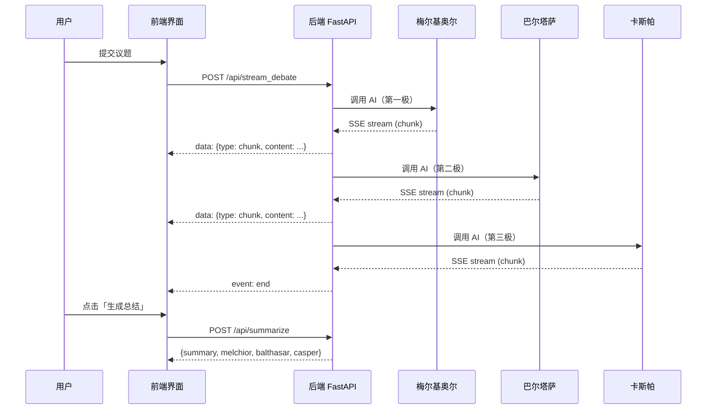

# MAGI 2.0 — 三贤人 AI 辩论系统

> *"MAGI は、三つの人格を持つコンピューターシステムです。"*
>
> *"MAGI 是一个拥有三个人格的计算机系统。"*
>
> — 《新世纪福音战士》(Neon Genesis Evangelion)

MAGI 2.0 是一个受《EVA》启发的 AI 辩论系统。它模拟三位拥有截然不同底层逻辑的「贤人」——**梅尔基奥尔**（绝对理性）、**巴尔塔萨**（伦理守护）、**卡斯帕**（先锋解构）——围绕用户提交的任意议题展开多轮深度辩论，最终生成结构化总结报告。

---

## 架构总览

```
┌─────────────────────────────────────────────────────────┐
│                    MAGI 2.0 System                       │
│                                                         │
│  ┌──────────────┐     ┌──────────────────────────────┐  │
│  │   Frontend    │     │          Backend              │  │
│  │  (Next.js 16) │◄───►│       (FastAPI + SSE)        │  │
│  │  Port 3000    │     │       Port 8000              │  │
│  └──────────────┘     └───────────┬──────────────────┘  │
│                                    │                     │
│                          ┌─────────▼─────────┐          │
│                          │   AI Providers     │          │
│                          │  DeepSeek / Kimi   │          │
│                          └───────────────────┘          │
└─────────────────────────────────────────────────────────┘
```

### 核心流程



---

## 三贤人人格设定

| 代号 | 名称 | 底层逻辑 | 角色定位 |
|------|------|----------|----------|
| **Melchior** | 梅尔基奥尔 | 绝对理性与结构主义 | 第一极：拆解议题为变量与模型，追求效率最优解 |
| **Balthasar** | 巴尔塔萨 | 伦理边界与长期防护 | 第二极：审视理性背后的伦理代价与长期风险 |
| **Casper** | 卡斯帕 | 先锋解构与直觉 | 第三极：解构宏大叙事，聚焦个体生命体验与混沌 |

每位贤人发言结束后会给出明确表态：**承认** / **否认** / **疑虑**。

---

## 技术栈

### 前端 (`magi_front/`)

| 技术 | 用途 |
|------|------|
| **Next.js 16** (React 19) | 框架 |
| **TypeScript** | 类型安全 |
| **Tailwind CSS v4** | 样式系统 |
| **Zustand** | 全局状态管理 |
| **CSS Grid + Flexbox** | 布局（严格禁止 position: absolute/fixed） |

### 后端 (`backend/`)

| 技术 | 用途 |
|------|------|
| **FastAPI** | API 服务 |
| **Server-Sent Events (SSE)** | 流式传输辩论内容 |
| **OpenAI SDK** | 统一调用 DeepSeek / Kimi API |
| **OpenCC** | 简体 → 香港繁体转换 |

### 支持的 AI 提供商

- **DeepSeek** — `deepseek-chat`
- **Kimi (Moonshot)** — `moonshot-v1-8k` / `moonshot-v1-32k`

---

## 快速开始

### 前置条件

- Python 3.10+
- Node.js 20+
- 有效的 AI API Key（DeepSeek / Kimi）

### 1. 克隆并安装

```bash
git clone <your-repo-url>
cd MAGI2_0

# 后端
cd backend
python -m venv venv
source venv/bin/activate
pip install -r requirements.txt

# 前端
cd ../magi_front
npm install
```

### 2. 配置环境变量

在项目根目录创建 `.env` 文件：

```env
DEEPSEEK_API_KEY=sk-your-deepseek-key
KIMI_API_KEY=sk-your-kimi-key
```

### 3. 启动

**方式一：一键启动**

```bash
chmod +x start.sh
./start.sh
```

**方式二：分别启动**

```bash
# 终端 1 — 后端
cd backend
source venv/bin/activate
uvicorn backend.main:app --reload --port 8000 --host 0.0.0.0

# 终端 2 — 前端
cd magi_front
npm run dev
```

打开浏览器访问 `http://localhost:3000`。

---

## 项目结构

```
MAGI2_0/
├── backend/                    # FastAPI 后端
│   ├── main.py                 # API 路由 + SSE 流式辩论
│   ├── agent_core.py           # AI 调用核心（多 Provider 路由）
│   ├── prompts.py              # 三贤人人格提示词 + 总结提示词
│   ├── config.py               # 模型路由表（lite/pro 档位）
│   └── translator.py           # 简繁转换中间件
│
├── magi_front/                 # Next.js 前端
│   └── src/
│       ├── app/
│       │   ├── globals.css      # 全局样式 + 动画关键帧
│       │   ├── layout.tsx       # 根布局
│       │   └── page.tsx         # 入口页面
│       ├── components/
│       │   ├── layout/          # 布局组件
│       │   │   └── magi-grid.tsx    # 主界面 Grid 布局
│       │   ├── module/          # 模块组件
│       │   │   ├── magi-page.tsx         # 主页面编排
│       │   │   ├── debate-controller.tsx # 辩论控制器 Hook
│       │   │   ├── magi-unit.tsx         # 贤人单元卡片
│       │   │   ├── video-panel.tsx       # 总结面板（打字机效果）
│       │   │   ├── proposal-panel.tsx    # 议题输入面板
│       │   │   ├── verdict-panel.tsx     # 表态决议面板
│       │   │   ├── nerv-hex-bg.tsx       # 六边形呼吸背景
│       │   │   └── boot-*.tsx            # 启动序列
│       │   └── ui/              # UI 原子组件
│       │       ├── model-selector.tsx
│       │       ├── topic-input.tsx
│       │       ├── control-buttons.tsx
│       │       ├── verdict-badge.tsx
│       │       ├── status-indicator.tsx
│       │       └── log-viewer.tsx
│       ├── store/
│       │   └── debate-store.ts  # Zustand 全局状态
│       ├── lib/
│       │   └── api.ts           # API 通信层（SSE + fetch）
│       └── types/
│           └── index.ts         # TypeScript 类型定义
│
├── start.sh                     # 一键启动脚本
├── 启动MAGI2.command            # macOS 双击启动
└── README.md
```

---

## API 文档

### `POST /api/stream_debate`

发起流式辩论。后端按顺序调用三贤人，通过 SSE 实时推送。

**请求体：**
```json
{
  "topic": "人工智能是否应该拥有法律人格？",
  "tier": "lite",
  "history": "",
  "directive": "",
  "model_choice": {
    "melchior": "DeepSeek 轻量",
    "balthasar": "Kimi 轻量",
    "casper": "Kimi 轻量"
  }
}
```

**SSE 事件流：**
```
data: {"type": "sys",     "content": "新議題已呈上"}
data: {"type": "start",   "role": "melchior"}
data: {"type": "chunk",   "content": "让我们来拆解这个议题..."}
data: {"type": "verdict", "role": "melchior", "verdict": "承認"}
event: end
data: {}
```

### `POST /api/summarize`

生成辩论总结报告。

**请求体：**
```json
{
  "history": "初始議題：...\n\n【系統】...\n【梅爾基奧】...",
  "topic": "人工智能是否应该拥有法律人格？"
}
```

**响应：**
```json
{
  "summary": "本次辩论围绕...展开，三位贤人从不同维度进行了深入剖析...",
  "melchior": "梅尔基奥尔从效率与系统优化的角度...",
  "balthasar": "巴尔塔萨强调伦理底线与社会契约...",
  "casper": "卡斯帕则聚焦于个体生命体验..."
}
```

### `POST /api/health`

健康检查。

```json
// Request:  {"role": "melchior"}
// Response: {"status": "ok", "role": "melchior"}
```

---

## 视觉风格

- **主题色**：琥珀色 `#c0843c` / 红色 `#DA291C`（EVA 风格）
- **字体**：MatissePro（EVA 标题字体）
- **布局**：CSS Grid 四宫格（议题 / 梅尔基奥尔 / 决议 / 巴尔塔萨 / 总结 / 卡斯帕）
- **动效**：
  - 启动序列（NERV / SCP 基金会风格）
  - 六边形呼吸背景
  - 发言时整框呼吸闪烁（琥珀色）
  - 打字机逐字输出效果
  - 总结生成时黄色呼吸动画
  - CRT 扫描线覆盖

---

## 架构原则

| 规则 | 描述 |
|------|------|
| R1 | 仅使用 CSS Grid + Flexbox 布局，禁止 `position: absolute/fixed` |
| R2 | 4 层组件架构：Page → Layout → Module → UI |
| R3 | 每个组件文件 ≤ 200 行 |
| R4 | 全局状态统一由 Zustand 管理，Store Action 是唯一修改途径 |
| R5 | API 层为纯函数，不直接操作 UI 状态 |
| R6 | SSE 流式数据通过回调函数传递给 Store Action |
| R7 | `useCallback` 包裹所有回调函数 |

---

## 许可证

MIT License

---

*"MAGI は常に真実を語る。しかし、その真実は三つの異なる視点を通してのみ明らかになる。"*
