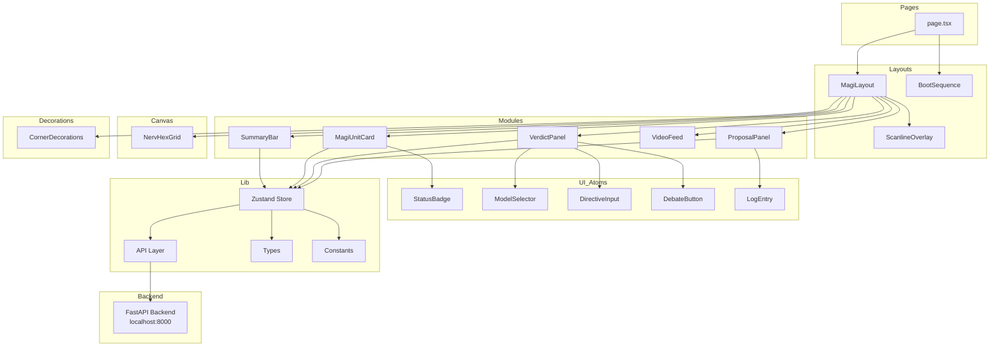

# MAGI2.0 前端重构计划书

> **版本**: v1.0  
> **状态**: 待审批  
> **目标**: 对 MAGI_System 前端进行彻底重构，解决因迭代过多导致的布局错位、代码耦合、状态混乱等问题  
> **范围**: 仅重构前端（`magi_front/MAGI_DEMO/`），后端（`backend/`）保持不变  
> **技术栈**: Next.js 16 + React 19 + Tailwind CSS 4 + shadcn/ui + Zustand

---

## 一、原有项目问题诊断

### 1.1 核心问题清单

| # | 问题 | 严重程度 | 根因 |
|---|------|---------|------|
| 1 | **布局错位** | 🔴 致命 | 混合使用 `absolute` 百分比定位 + `CSS Grid`，两者互相干扰 |
| 2 | **单文件过大** | 🔴 致命 | [`magi-system.tsx`](../magi_front/MAGI_DEMO/components/magi-system.tsx) 566 行，UI + 状态 + API 调用全部耦合 |
| 3 | **状态管理混乱** | 🟠 严重 | 全部使用 `useState` + `useRef` 手动同步，导致闭包陷阱（Bug 3 的根因） |
| 4 | **CSS 全局污染** | 🟠 严重 | 所有动画和样式集中在 [`globals.css`](../magi_front/MAGI_DEMO/app/globals.css) 794 行，无模块化 |
| 5 | **组件层级不清晰** | 🟡 中等 | 无明确的组件层级规范，子组件与主组件混用 |
| 6 | **API 层与 UI 耦合** | 🟡 中等 | [`api.ts`](../magi_front/MAGI_DEMO/lib/api.ts) 虽然独立但回调函数直接操作 UI 状态 |
| 7 | **无 TypeScript 严格模式** | 🟢 轻微 | 多处使用 `any` 类型，`as` 强制类型转换 |
| 8 | **硬编码常量散落** | 🟢 轻微 | 角色名称、颜色值、API 地址等散落在各文件中 |

### 1.2 原有布局架构（问题架构）

```
magi-system.tsx (566行)
├── 启动序列 (BootSequenceSCP)
├── 主容器 (fixed inset-0 flex flex-col)
│   ├── 标题栏
│   ├── Grid 容器 (grid + absolute 混合)
│   │   ├── 提訴区域 (grid-area: proposal)
│   │   ├── MELCHIOR (grid-area: melchior)
│   │   ├── 決議区域 (grid-area: verdict) ← 包含按钮+模型选择+输入
│   │   ├── BALTHASAR (grid-area: balthasar)
│   │   ├── VIDEO FEED (grid-area: video)
│   │   └── CASPER (grid-area: casper)
│   └── 底部状态栏
├── NervHexCorner (Canvas 六边形)
├── 扫描线覆盖层
└── 背景纹理
```

**问题所在**：Grid 容器内部使用了 `absolute inset-0` 填充父容器，但子元素又混合使用了 `grid-area` 和 `absolute` 定位，两者冲突导致错位。

---

## 二、前端核心技术规范（铁律）

> ⚠️ **以下规范为 MAGI2.0 前端架构的铁律，任何后续迭代不得违反。违反即导致重构。**

### 2.1 布局铁律

| 规则 | 内容 | 违背后果 |
|------|------|---------|
| **R1** | 页面级布局**只使用** `CSS Grid` + `Flexbox`，**严禁**任何 `position: absolute` / `fixed` 定位 | 布局错位 |
| **R2** | 所有尺寸使用 `fr`、`%`、`vh`/`vw` 相对单位，**严禁** `px` 硬编码（Canvas 内部除外） | 响应式失效 |
| **R3** | Grid 区域命名使用 `grid-template-areas` 语义化命名，**严禁**数字索引（`grid-area: 1/1/2/2`） | 可读性丧失 |
| **R4** | 层级控制使用 `z-index` CSS 变量（`--z-*`），**严禁**随意写数字 | 层级混乱 |
| **R5** | 每个容器组件必须有明确的 `min-height: 0` 和 `overflow` 策略 | 内容溢出 |

### 2.2 组件架构铁律

| 规则 | 内容 |
|------|------|
| **R6** | 每个文件不超过 200 行，超过必须拆分 |
| **R7** | 组件分为 4 层：`page` → `layout` → `module` → `ui`，下层不可引用上层 |
| **R8** | 所有组件必须是 `"use client"` 或 `"use server"` 明确标记 |
| **R9** | 禁止在组件内部直接调用 API，必须通过 Store 层转发 |

### 2.3 状态管理铁律

| 规则 | 内容 |
|------|------|
| **R10** | 全局状态（辩论状态、日志、三贤人数据）统一使用 **Zustand** Store |
| **R11** | 组件局部 UI 状态（输入框值、下拉菜单展开等）使用 `useState` |
| **R12** | **严禁**使用 `useRef` 来同步 state（原有项目 Bug 3 的根因） |
| **R13** | **严禁**在 `setState` 回调中执行副作用（API 调用等） |

### 2.4 样式铁律

| 规则 | 内容 |
|------|------|
| **R14** | 全局样式（主题变量、字体、基础重置）保留在 `globals.css` |
| **R15** | 组件级动画使用 Tailwind `@apply` 或 CSS Modules，**严禁**在 `globals.css` 中定义组件专属动画 |
| **R16** | 颜色值统一使用 CSS 变量（`var(--magi-*)`），**严禁**硬编码 oklch/rgb |

### 2.5 API 通信铁律

| 规则 | 内容 |
|------|------|
| **R17** | API 层只返回数据，不操作 UI 状态 |
| **R18** | SSE 流式数据通过 Store Action 分发，组件只订阅 Store |
| **R19** | API BASE URL 通过环境变量 `NEXT_PUBLIC_API_BASE` 配置 |

---

## 三、目标架构设计

### 3.1 组件层级树

```
pages/                          # 页面层（page）
└── page.tsx                    # 根页面，仅渲染 Layout

components/
├── layouts/                    # 布局层（layout）
│   ├── magi-layout.tsx         # 主布局：Grid 容器 + 标题 + 状态栏
│   ├── boot-sequence.tsx       # 启动序列覆盖层
│   └── scanline-overlay.tsx    # CRT 扫描线覆盖层
│
├── modules/                    # 模块层（module）
│   ├── proposal-panel.tsx      # 提訴区域（日志面板）
│   ├── verdict-panel.tsx       # 決議区域（输入 + 控制按钮 + 模型选择）
│   ├── magi-unit-card.tsx      # 三贤人卡片（MELCHIOR/BALTHASAR/CASPER）
│   ├── video-feed.tsx          # VIDEO FEED 预留区域
│   └── summary-bar.tsx         # 底部状态栏
│
├── ui/                         # UI 层（ui）— 原子组件
│   ├── status-badge.tsx        # 状态徽章（承認/否決/審議中）
│   ├── model-selector.tsx      # 模型选择下拉菜单
│   ├── directive-input.tsx     # 方向控制输入框
│   ├── debate-button.tsx       # 辩论控制按钮（開始/繼續/總結）
│   └── log-entry.tsx           # 单条日志渲染（含 Markdown + 光标）
│
├── canvas/                     # Canvas 组件（特殊渲染层）
│   └── nerv-hex-grid.tsx       # NERV 六边形呼吸灯阵列（Canvas 实现）
│
└── decorations/                # 装饰层
    └── corner-decorations.tsx  # 四角信息标签

lib/                            # 工具层
├── api.ts                      # API 通信层（纯函数，不操作 UI）
├── store.ts                    # Zustand Store（全局状态）
├── types.ts                    # 类型定义
└── constants.ts                # 常量（角色数据、颜色映射等）
```

### 3.2 数据流架构

```
用户操作（点击"開始"）
    │
    ▼
VerdictPanel (module)
    │ 调用 store.startDebate()
    ▼
Zustand Store (store.ts)
    │ 更新 isDebating=true
    │ 调用 api.streamDebate()
    ▼
API Layer (api.ts)
    │ 返回 SSE 流
    │ 通过 Store Action 分发数据
    ▼
Zustand Store (store.ts)
    │ 更新 logLines, units, currentSpeaker 等
    ▼
各模块自动重渲染
├── ProposalPanel → 日志列表更新
├── MagiUnitCard → 状态/总结更新
├── VerdictPanel → 按钮禁用状态更新
└── SummaryBar → 系统状态更新
```

### 3.3 Grid 布局定义（严格锁定）

```css
/* 主 Grid 布局 — 此定义在重构后不得修改 */
grid-template-columns: 22% 1fr 22%;    /* 左:中:右 */
grid-template-rows: 1fr 1fr;           /* 上:下 */
grid-template-areas:
  "proposal  melchior  verdict"
  "balthasar video     casper";
```

```
┌─────────────────────────────────────────────────────┐
│  MAGI SYSTEM 标题 (flex-shrink-0)                    │
├──────────┬──────────────────────────┬────────────────┤
│          │                          │                │
│  提訴     │      MELCHIOR·1          │   決議         │
│  PROPOSAL│     (科學家的視點)        │   VERDICT      │
│  (日志)   │                          │  输入+按钮     │
│          │                          │                │
├──────────┼──────────────────────────┼────────────────┤
│          │                          │                │
│ BALTHASAR│     VIDEO FEED           │   CASPER·3     │
│ ·2       │     (映像)               │   (女人的視點)  │
│ (母性)   │                          │                │
│          │                          │                │
├──────────┴──────────────────────────┴────────────────┤
│  SYS_STATUS / MAGI_LINK (flex-shrink-0)              │
└─────────────────────────────────────────────────────┘
```

### 3.4 Zustand Store 设计

```typescript
// store.ts — 全局状态定义

interface MagiStore {
  // 辩论状态
  isDebating: boolean
  currentSpeaker: string | null
  sysStatus: 'STANDBY' | 'DEBATING' | 'ERROR'
  
  // 三贤人数据
  units: UnitData[]
  
  // 日志
  logLines: LogEntry[]
  
  // 辩论历史
  debateHistory: string
  directive: string
  
  // 总结
  summary: SummaryResult | null
  isSummarizing: boolean
  
  // 模型选择（持久化到 localStorage）
  modelChoice: Record<string, string>
  
  // Actions
  startDebate: (topic: string, tier: string) => void
  continueDebate: () => void
  handleStreamChunk: (data: StreamChunk) => void
  handleStreamEnd: () => void
  handleStreamError: (err: Error) => void
  fetchAndSetSummary: () => Promise<void>
  setDirective: (d: string) => void
  setModelChoice: (role: string, model: string) => void
  resetDebate: () => void
}
```

---

## 四、分步实施计划

### 阶段 1：项目初始化与基础设施

| # | 任务 | 说明 | 涉及文件 |
|---|------|------|----------|
| 1.1 | 初始化 Next.js 项目 | 在 `MAGI2_0` 目录下创建新 Next.js 项目 | 新建项目 |
| 1.2 | 安装核心依赖 | Tailwind CSS, Zustand, react-markdown, remark-gfm, lucide-react | `package.json` |
| 1.3 | 配置 Tailwind 主题 | 移植原有项目的 MAGI 主题色、字体、CSS 变量 | `app/globals.css` |
| 1.4 | 配置路径别名 | `@/` 指向项目根目录 | `tsconfig.json` |
| 1.5 | 创建目录结构 | 按 3.1 节的组件层级树创建所有目录 | 目录结构 |

**风险**：Next.js 16 可能与某些依赖不兼容。  
**回退**：锁定依赖版本，使用 `--legacy-peer-deps`。

### 阶段 2：类型定义与常量层

| # | 任务 | 说明 | 涉及文件 |
|---|------|------|----------|
| 2.1 | 定义核心类型 | `UnitData`, `LogEntry`, `StreamChunk`, `SummaryResult` 等 | `lib/types.ts` |
| 2.2 | 定义常量 | 三贤人初始数据、状态徽章样式映射、角色名称映射 | `lib/constants.ts` |
| 2.3 | 定义 API 类型 | `DebateParams`, `UnitSummaryRequest` 等请求/响应类型 | `lib/types.ts` |

### 阶段 3：Zustand Store 层

| # | 任务 | 说明 | 涉及文件 |
|---|------|------|----------|
| 3.1 | 创建 Store | 实现 3.4 节定义的完整 Store | `lib/store.ts` |
| 3.2 | 实现 SSE 处理逻辑 | 将 `api.ts` 的流式回调映射到 Store Actions | `lib/store.ts` |
| 3.3 | 实现 localStorage 持久化 | 模型选择持久化中间件 | `lib/store.ts` |

**关键设计**：Store 内部使用 `useRef` 管理 SSE 连接和累积文本，但对外暴露的是响应式状态。组件只通过 `useStore` 订阅状态，不直接操作 ref。

### 阶段 4：UI 组件层（自底向上）

#### 4.1 原子 UI 组件

| # | 任务 | 说明 | 涉及文件 |
|---|------|------|----------|
| 4.1.1 | StatusBadge | 三贤人状态徽章（承認/否決/審議中） | `components/ui/status-badge.tsx` |
| 4.1.2 | ModelSelector | 模型选择下拉菜单 | `components/ui/model-selector.tsx` |
| 4.1.3 | DirectiveInput | 方向控制输入框 | `components/ui/directive-input.tsx` |
| 4.1.4 | DebateButton | 辩论控制按钮 | `components/ui/debate-button.tsx` |
| 4.1.5 | LogEntry | 单条日志渲染（含 Markdown + 打字机光标） | `components/ui/log-entry.tsx` |

#### 4.2 模块组件

| # | 任务 | 说明 | 涉及文件 |
|---|------|------|----------|
| 4.2.1 | ProposalPanel | 提訴区域（日志面板） | `components/modules/proposal-panel.tsx` |
| 4.2.2 | VerdictPanel | 決議区域（输入 + 按钮 + 模型选择） | `components/modules/verdict-panel.tsx` |
| 4.2.3 | MagiUnitCard | 三贤人卡片（含 clipPath 切角 + 观点总结） | `components/modules/magi-unit-card.tsx` |
| 4.2.4 | VideoFeed | VIDEO FEED 预留区域 | `components/modules/video-feed.tsx` |
| 4.2.5 | SummaryBar | 底部状态栏 | `components/modules/summary-bar.tsx` |

#### 4.3 布局组件

| # | 任务 | 说明 | 涉及文件 |
|---|------|------|----------|
| 4.3.1 | MagiLayout | 主 Grid 布局容器 | `components/layouts/magi-layout.tsx` |
| 4.3.2 | BootSequence | 启动序列（SCP → NERV → MAGI） | `components/layouts/boot-sequence.tsx` |
| 4.3.3 | ScanlineOverlay | CRT 扫描线覆盖层 | `components/layouts/scanline-overlay.tsx` |

#### 4.4 Canvas 与装饰组件

| # | 任务 | 说明 | 涉及文件 |
|---|------|------|----------|
| 4.4.1 | NervHexGrid | 六边形呼吸灯（移植原有 Canvas 实现） | `components/canvas/nerv-hex-grid.tsx` |
| 4.4.2 | CornerDecorations | 四角信息标签 | `components/decorations/corner-decorations.tsx` |

### 阶段 5：API 通信层

| # | 任务 | 说明 | 涉及文件 |
|---|------|------|----------|
| 5.1 | 实现 SSE 流式辩论 | 移植 `streamDebate`，改为纯函数返回数据 | `lib/api.ts` |
| 5.2 | 实现总结 API | 移植 `fetchSummary` | `lib/api.ts` |
| 5.3 | 实现单角色总结 API | 移植 `fetchUnitSummary` | `lib/api.ts` |
| 5.4 | 配置环境变量 | `NEXT_PUBLIC_API_BASE=http://localhost:8000` | `.env.local` |

### 阶段 6：集成与启动序列

| # | 任务 | 说明 | 涉及文件 |
|---|------|------|----------|
| 6.1 | 集成主页面 | 将 Layout + Store + API 串联 | `app/page.tsx` |
| 6.2 | 实现启动序列 | SCP 标志 → NERV 加载 → 主界面过渡 | `components/layouts/boot-sequence.tsx` |
| 6.3 | 实现 ESC 跳过 | 启动序列可跳过 | `components/layouts/boot-sequence.tsx` |

### 阶段 7：验证与测试

| # | 任务 | 说明 |
|---|------|------|
| 7.1 | 视觉验证 | 各模块位置、颜色、字体与原有项目一致 |
| 7.2 | 功能验证 | 输入议题 → 开始辩论 → 流式显示 → 总结 → 继续辩论 |
| 7.3 | 响应式验证 | 375px ~ 1920px 各断点布局正常 |
| 7.4 | 动画验证 | 启动序列、六边形呼吸灯、打字机光标、状态过渡 |
| 7.5 | 闭包验证 | 确认无 `useRef` 同步 state 的模式，无闭包陷阱 |

---

## 五、文件变更清单

### 新建文件（MAGI2_0 项目）

```
MAGI2_0/
├── app/
│   ├── globals.css              # 主题变量 + 全局动画（仅保留通用动画）
│   ├── layout.tsx               # 根布局
│   └── page.tsx                 # 主页面
├── components/
│   ├── layouts/
│   │   ├── magi-layout.tsx      # 主 Grid 布局
│   │   ├── boot-sequence.tsx    # 启动序列
│   │   └── scanline-overlay.tsx # CRT 扫描线
│   ├── modules/
│   │   ├── proposal-panel.tsx   # 提訴区域
│   │   ├── verdict-panel.tsx    # 決議区域
│   │   ├── magi-unit-card.tsx   # 三贤人卡片
│   │   ├── video-feed.tsx       # VIDEO FEED
│   │   └── summary-bar.tsx      # 底部状态栏
│   ├── ui/
│   │   ├── status-badge.tsx     # 状态徽章
│   │   ├── model-selector.tsx   # 模型选择
│   │   ├── directive-input.tsx  # 方向输入
│   │   ├── debate-button.tsx    # 辩论按钮
│   │   └── log-entry.tsx        # 日志条目
│   ├── canvas/
│   │   └── nerv-hex-grid.tsx    # 六边形呼吸灯
│   └── decorations/
│       └── corner-decorations.tsx # 四角装饰
├── lib/
│   ├── types.ts                 # 类型定义
│   ├── constants.ts             # 常量
│   ├── store.ts                 # Zustand Store
│   └── api.ts                   # API 通信层
├── public/
│   └── fonts/                   # 字体文件（从原项目复制）
├── package.json
├── tsconfig.json
├── next.config.mjs
├── postcss.config.mjs
└── .env.local                   # API 地址配置
```

### 无需改动的文件（后端保持不变）

```
MAGI_System/backend/
├── main.py          # ✅ 保持不变
├── config.py        # ✅ 保持不变
├── agent_core.py    # ✅ 保持不变
├── prompts.py       # ✅ 保持不变
└── translator.py    # ✅ 保持不变
```

---

## 六、潜在风险与回退策略

| 风险 | 概率 | 影响 | 缓解措施 |
|------|------|------|---------|
| Zustand 与 React 19 兼容性问题 | 低 | 高 | 锁定 Zustand 版本，准备降级到 React 18 |
| Canvas 六边形呼吸灯在重构后位置偏移 | 中 | 中 | 将 Canvas 尺寸和位置参数提取为常量，与 Grid 布局解耦 |
| SSE 流式数据在新 Store 架构中处理不当 | 中 | 高 | 先在 Store 中完整实现 SSE 处理逻辑，再接入 UI 组件 |
| Tailwind CSS 4 与 shadcn/ui 兼容性 | 低 | 中 | 使用 `tw-animate-css` 确保动画兼容 |
| 字体文件（Matisse Pro）版权/路径问题 | 低 | 低 | 从原项目复制字体文件到 `public/fonts/` |

**回退策略**：
1. **代码回退**：每个阶段完成后使用 Git 打 tag，出现问题可回退到上一个 tag
2. **功能回退**：若新前端出现不可解问题，可临时使用 `static/` 目录下的旧前端
3. **架构回退**：若 Zustand 方案出现问题，可回退到 React Context + useReducer 方案

---

## 七、验证方法

| 阶段 | 验证方法 |
|------|----------|
| 阶段 1 | `pnpm dev` 启动成功，浏览器打开看到空白页面无报错 |
| 阶段 2 | TypeScript 编译通过，无类型错误 |
| 阶段 3 | Store 单元测试通过（使用 `vitest`） |
| 阶段 4 | 各组件独立渲染正常，Storybook 可视化验证 |
| 阶段 5 | `curl` 测试后端 API 正常返回 |
| 阶段 6 | 端到端测试：启动序列 → 主界面 → 辩论 → 总结 |
| 阶段 7 | 与原有项目并排对比，视觉和功能一致 |

---

## 八、实施顺序建议

```
阶段 1 ──→ 阶段 2 ──→ 阶段 3 ──→ 阶段 4 ──→ 阶段 5 ──→ 阶段 6 ──→ 阶段 7
(初始化)   (类型)     (Store)    (组件)     (API)     (集成)     (验证)
                                    │
                                    └── 4.1 → 4.2 → 4.3 → 4.4
                                    (UI)  (模块) (布局) (Canvas)
```

**关键路径**：阶段 3（Store）是核心依赖，必须先完成。阶段 4 的 UI 组件可以并行开发。

---

## 九、MAGI2.0 前端架构全景图



---

## 十、审批

请审查此计划，若无异议请批准。批准后，请切换至 **Code 模式** 进行落地。

**关键确认点**：
1. ✅ 前端核心技术规范（布局铁律 R1-R5、组件架构 R6-R9、状态管理 R10-R13、样式 R14-R16、API R17-R19）是否接受？
2. ✅ Grid 布局定义（`22% 1fr 22%` + `1fr 1fr`）是否锁定？
3. ✅ Zustand 作为全局状态管理方案是否同意？
4. ✅ 组件拆分到 20+ 文件的粒度是否合适？
